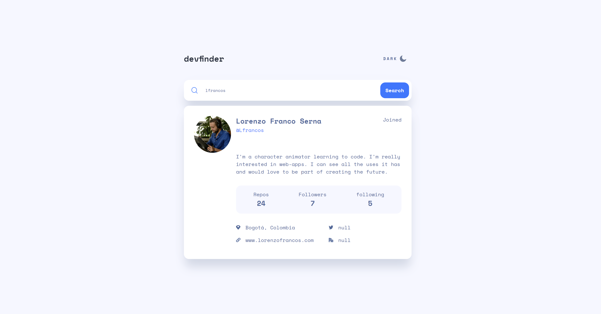

# Frontend Mentor - GitHub user search app solution

This is a solution to the [GitHub user search app challenge on Frontend Mentor](https://www.frontendmentor.io/challenges/github-user-search-app-Q09YOgaH6). Frontend Mentor challenges help you improve your coding skills by building realistic projects.

## Table of contents

- [Overview](#overview)
  - [The challenge](#the-challenge)
  - [Screenshot](#screenshot)
  - [Links](#links)
- [My process](#my-process)
  - [Built with](#built-with)
  - [What I learned](#what-i-learned)
  - [Continued development](#continued-development)
  - [Useful resources](#useful-resources)
- [Author](#author)

## Overview

### The challenge

Users should be able to:

- View the optimal layout for the app depending on their device's screen size
- See hover states for all interactive elements on the page
- Search for GitHub users by their username
- See relevant user information based on their search
- Switch between light and dark themes
- **Bonus**: Have the correct color scheme chosen for them based on their computer preferences. _Hint_: Research `prefers-color-scheme` in CSS.

### Screenshot

### Links

- Solution URL: [here](https://github.com/Lfrancos/github-user-search-app)
- Live Site URL: [here](https://lfrancos.github.io/github-user-search-app/)

## My process

### Built with

- Semantic HTML5 markup
- CSS custom properties
- Flexbox
- CSS Grid
- Mobile-first workflow
- [React](https://reactjs.org/) - JS library
- [Next.js](https://nextjs.org/) - React framework
- [Styled Components](https://styled-components.com/) - For styles

### What I learned

This was a really interesting challenge. I practice a little bit more about error handling, also I'm starting o understand a little better callbacks :) that is exiting.
It was really interesting to have to create color themes, I approached it as I was used to and realized that that is not the way to do it. By creating variables that can change with javascript is way better.

### Continued development

I need to get more comfortable with grid, I was able to achieve the result with out it but I feel that I would be able to position things a little better with grid. I need to feel good using it and not be afraid to change classes and order in order to achieve what I want to achieve.

### Useful resources

- [resource 1](https://webdesign.tutsplus.com/tutorials/color-schemes-with-css-variables-and-javascript--cms-36989) - This helped me understand a little better how to achieve the change of color scheme.

## Author

- Website - [@lorenzo.francos](https://www.lorenzofrancos.com)
- Instagram - [@lorenzo.francos](https://www.instagram.com/lorenzo.francos/?hl=en)
- Github - [@Lfrancos](https://github.com/Lfrancos)
- Frontend Mentor - [@Lfrancos](https://www.frontendmentor.io/profile/Lfrancos)
